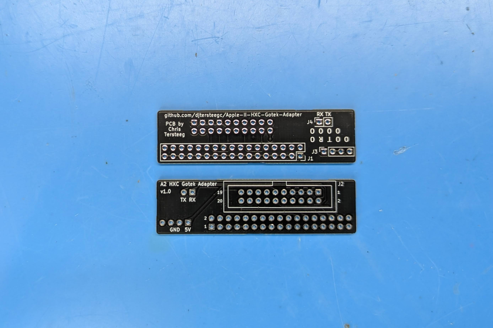
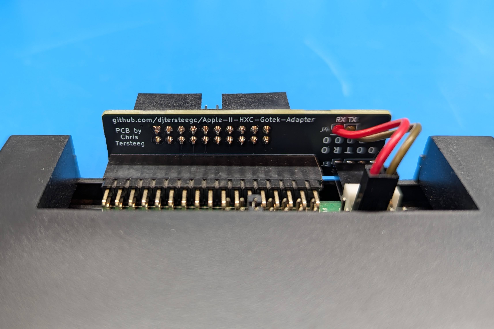

Simple adapter PCB based on the wiring diagram from https://hxc2001.com/docs/gotek-floppy-emulator-hxc-firmware/pages/apple.html

### BOM

[Interactive BOM](https://djtersteegc.github.io/Apple-II-HXC-Gotek-Adapter/ibom.html)

| Item                                | Qty  | Notes                               | Link                                                         |
| ----------------------------------- | ---- | ----------------------------------- | ------------------------------------------------------------ |
| 2x17 34p 2.54mm Female Pin Socket   | 1    |                                     | [AliExpress](https://www.aliexpress.us/item/3256805948524386.html) |
| 2x10 20p 2.54mm IDC Male Box Header | 1    |                                     | [AliExpress](https://www.aliexpress.us/item/3256807284267150.html) |
| 1x4 4p 2.54mm Female Pin Socket     | 1    |                                     | [AliExpress](https://www.aliexpress.us/item/2255800509919410.html) |
| Female Dupont Jumper Wires          | 2    | From adapter to Gotek TX/RX headers | [AliExpress](https://www.aliexpress.us/item/3256807188673626.html) |
| 1x40 2.54mm Male Header             | 1    | To populate Gotek header pins       | [AliExpress](https://www.aliexpress.us/item/3256805949945647.html) |

